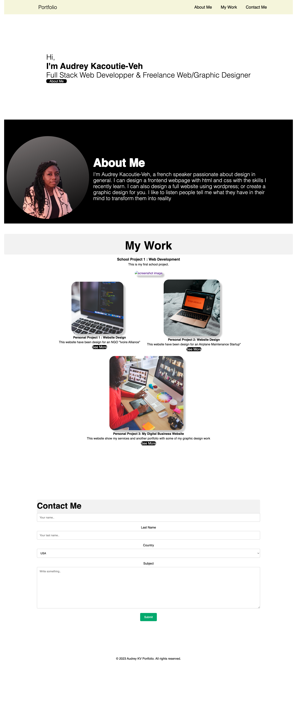

# Audrey_1st_Portfolio

Responsive Portfolio Website

This project was my second challenge, for me as a new web developper. My goal was to build a responsive portfolio web page. It was a challenge for me because I wanted it efficient but also beautiful. The principal issue for me was the design part. I could spend a lot of hours to design it just to try all the possibility I have. I really enjoyed working in this project, and I will continue to improve it with the time. It help me improve my css style skills.

Usage 

Link to deploy 
https://audidi29.github.io/Audrey_1st_Portfolio/
